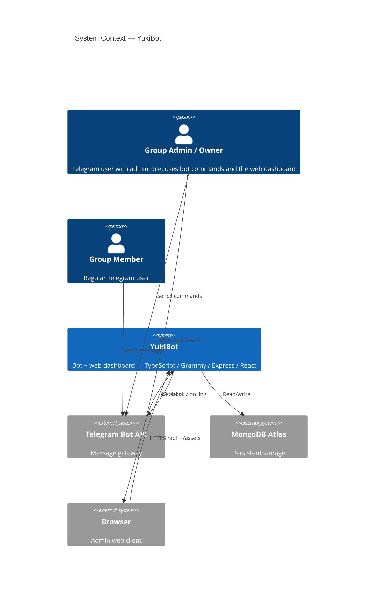
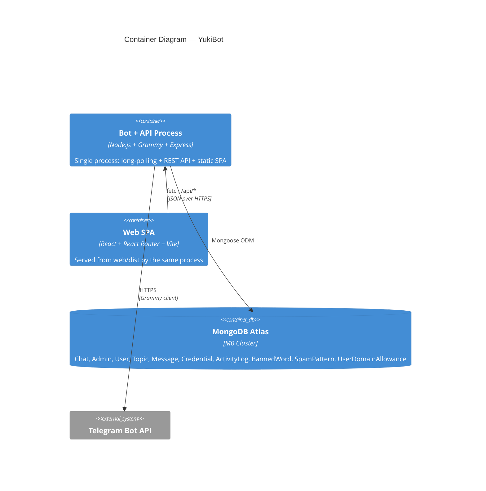
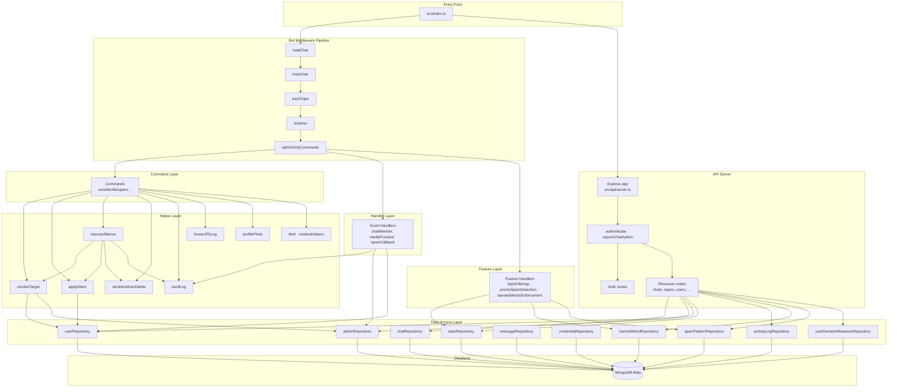
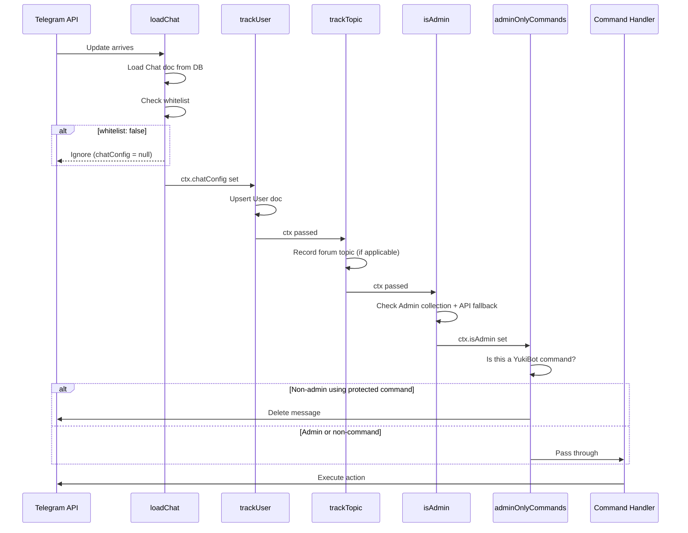
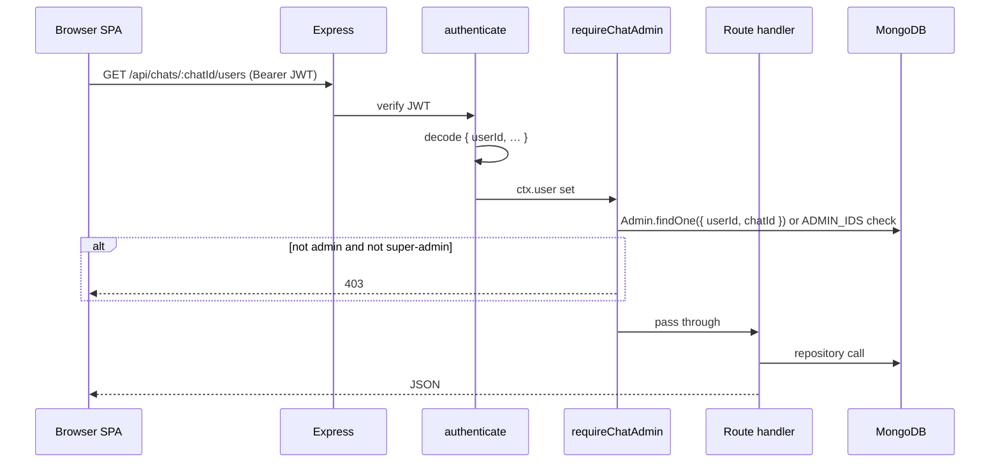
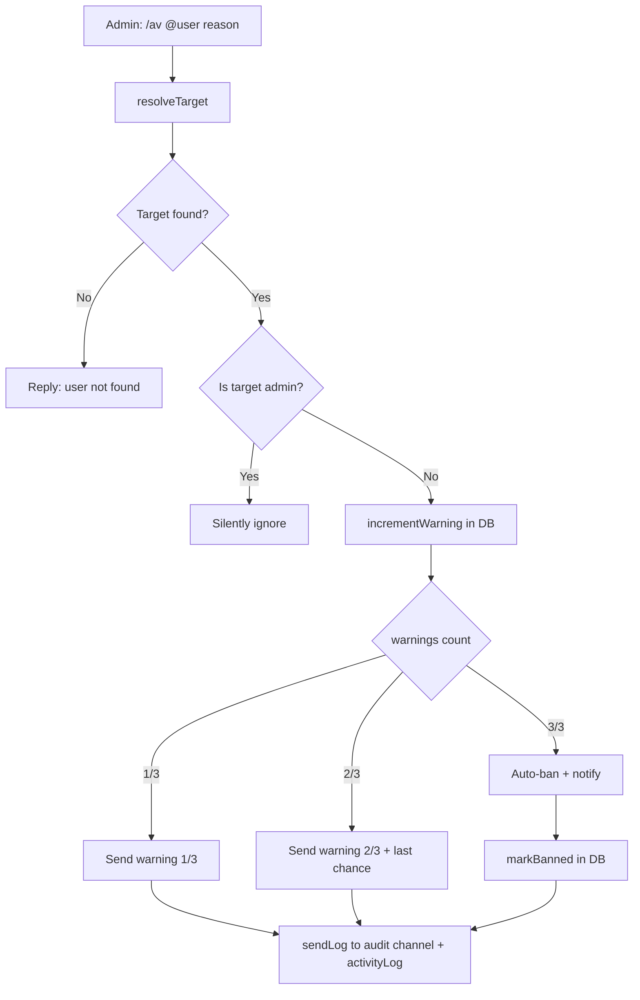
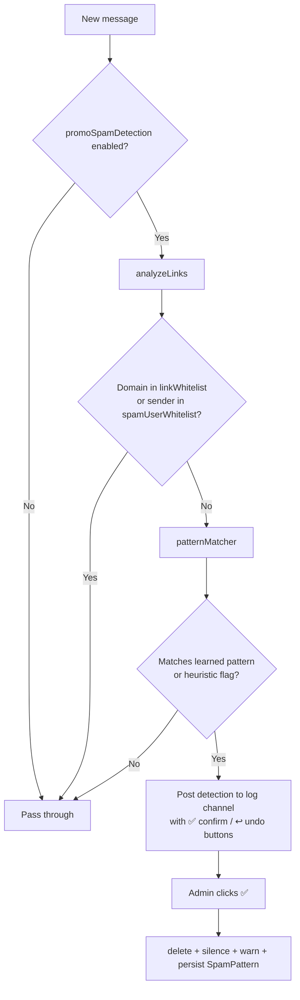
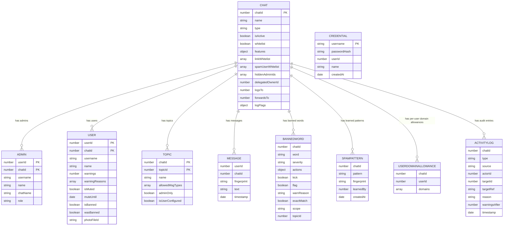
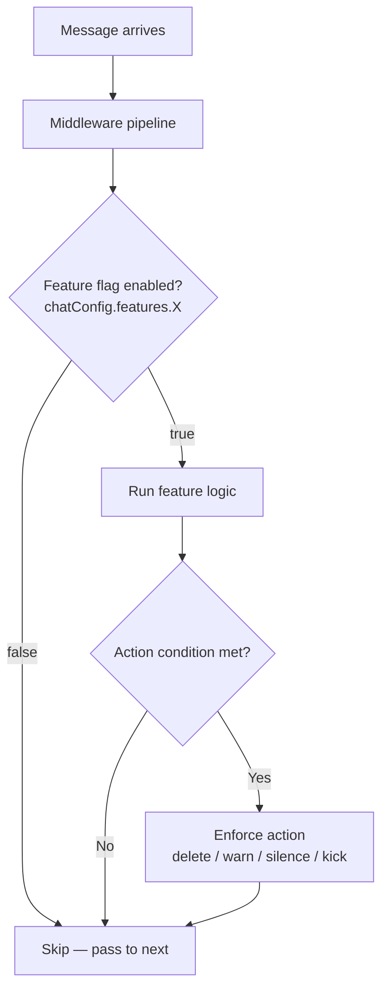
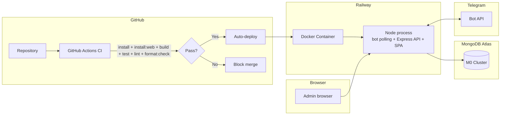

# Architecture — YukiBot

> Technical architecture documentation for the YukiBot Telegram moderation bot and its companion web dashboard.

## System Context (C4 — Level 1)

## Container Diagram (C4 — Level 2)

## Layered Architecture

## Bot Middleware Pipeline

The middleware pipeline is critical and **order-sensitive**. Each stage enriches the `BotContext`:

## API Request Pipeline

## Warning System Flow

## Anti-spam Flow

## Database Entity Relationships

## Feature Flag Pattern

## Deployment Architecture

